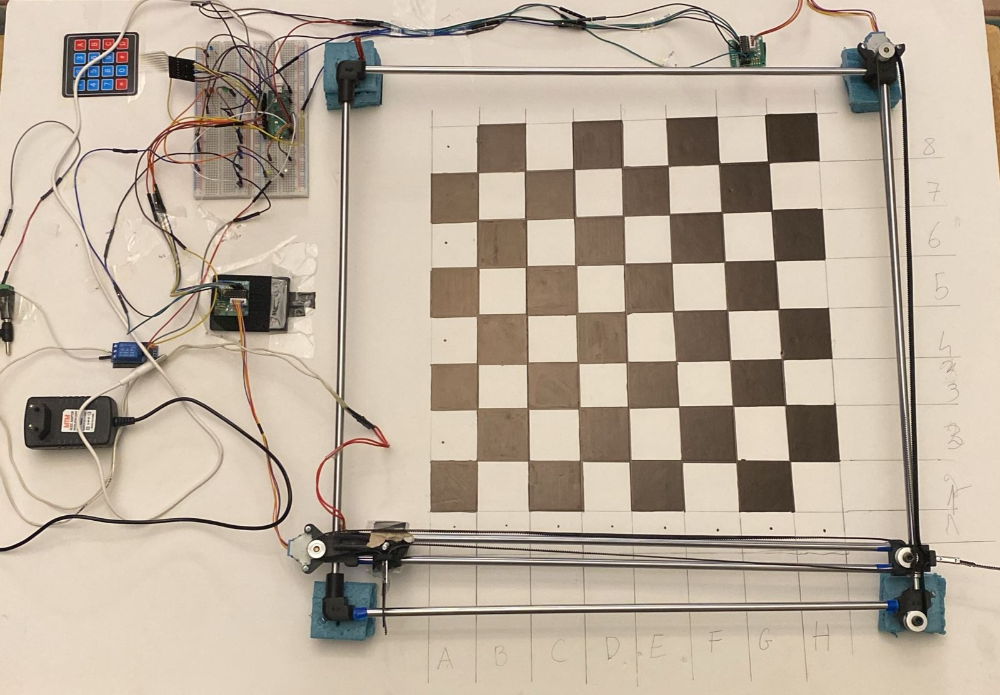

# Smart Chess Embedded Project

This project is an embedded system implementation of a smart chess pvp game.

## Table of Contents

- [Introduction](#introduction)
- [Features](#features)
- [Pictures](#pictures)
- [License](#license)

## Introduction

Our project is a smart chess embedded system, designed and built from the ground up to revolutionize the way chess is played. Utilizing a Raspberry Pi Pico at its core, we've created an interactive, automated chessboard that brings the game to life. The system integrates physical components such as 3D printed chess pieces, iron rods, pulleys, and linear bearings to construct a 2D plotter. An electromagnet, fixed upside down on the plotter, is responsible for moving the chess pieces across the board. The entire chess logic, including piece movements, validations, check and checkmate situations, is implemented in C. The system also uses LED lighting for player feedback, indicating turns, checks, checkmates, and invalid moves.

## Features

- **Automated Chessboard**: The chessboard uses a 2D plotter and an electromagnet to move pieces automatically based on player inputs.
- **Player Input via Keypad**: Players input the old and new positions of a piece on a keypad, and the system moves the piece accordingly.
- **Chess Logic in C**: The system implements all chess rules, including movement validations and check/checkmate situations, in C.
- **LED Feedback System**: The system uses LED lights to provide feedback to the player, indicating turns, checks, checkmates, and invalid moves.
- **Stepper Motors**: The system uses stepper motors to control the precise movements of the 2D plotter.
- **Raspberry Pi Pico**: The heart of the system is a Raspberry Pi Pico, controlling all operations and ensuring smooth gameplay.

## Pictures

## License

This project is licensed under the MIT License. See the [LICENSE](LICENSE.txt) file for details.
